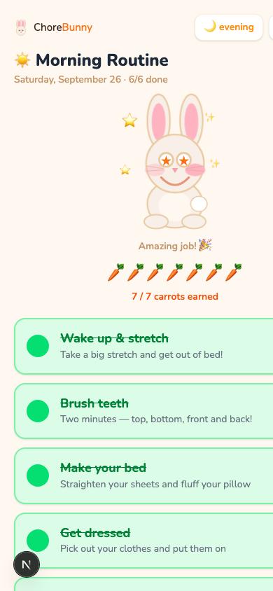

# 🐰 ChoreBunny

A rabbit-themed chore tracker for kids. Helps children complete their morning and evening routines by earning carrot rewards for each task.

**Live app: [chorebunny-app.fly.dev](https://chorebunny-app.fly.dev)**



## Features

- **Morning & evening routines** — auto-redirects based on time of day
- **One-tap task completion** — tap any chore to mark it done
- **Carrot rewards** — each task is worth 1–5 carrots; harder tasks earn more
- **Rabbit mascot** — mood changes as you make progress
- **Celebration confetti** — fires when every task in a routine is done
- **Backfill missed days** — navigate back with the date picker to log previous days
- **Task manager** — parents can add, hide, or delete chores at `/tasks`
- **Metrics** — 90-day heatmap and trend charts at `/metrics`

## Architecture

```
chorebunny/
├── backend/      FastAPI (Python 3.12) + SQLAlchemy + SQLite
└── frontend/     Next.js 16 (TypeScript) + Tailwind CSS + TanStack Query
```

**Backend** (`localhost:8000`)
- FastAPI REST API with automatic OpenAPI docs at `/docs`
- SQLAlchemy ORM with Alembic migrations
- SQLite database (file: `backend/chorebunny.db`)
- Key endpoints: `GET /api/tasks`, `POST /api/completions/toggle`, `GET /api/summary`

**Frontend** (`localhost:3000`)
- Next.js App Router with TypeScript
- TanStack Query for server state (optimistic toggle updates)
- Tailwind CSS with a cream/orange/green palette and Nunito font
- Routes: `/morning`, `/evening`, `/tasks`

## Running locally

### Prerequisites

- Python 3.12 ([Homebrew](https://brew.sh): `brew install python@3.12`)
- Node.js 20+ ([Homebrew](https://brew.sh): `brew install node`)

### First-time setup

```bash
# Install dependencies
cd backend && /opt/homebrew/bin/python3.12 -m venv .venv && .venv/bin/pip install -r requirements.txt
cd ../frontend && npm install

# Create database and seed default chores
cd ../backend && .venv/bin/alembic upgrade head && .venv/bin/python seed.py
```

### Start dev servers

Export these variables in the shell that starts both servers (use distinct,
random values for the API key and password):

- `API_KEY`: shared only by the backend and Next.js server; required at backend startup.
- `APP_USERNAME` and `APP_PASSWORD`: the household login for the frontend.
- `API_URL`: backend URL used by the Next.js server; defaults to `http://localhost:8000`.

```bash
# From the repo root — starts both servers in parallel
make dev
```

Or individually:

```bash
make dev-backend   # FastAPI on http://localhost:8000
make dev-frontend  # Next.js on http://localhost:3000
```

Open **http://localhost:3000** — it redirects to `/morning` or `/evening` based on the current time.
Your browser first prompts for the household login using HTTP Basic authentication.
This login grants access to all chores and management routes; there are no separate
parent/child roles. Use HTTPS outside local development.

Browser API requests use same-origin `/api` routes. Each route verifies the login
before forwarding to the backend with the server's `API_KEY`. Direct backend API
requests require an exact `X-Api-Key` header; `/health` stays public. The proxy
requires a matching `Origin` header on writes to prevent cross-site submissions.

### Running with Docker

Export `API_KEY`, `APP_USERNAME`, and `APP_PASSWORD` as above, then run:

```bash
docker compose up --build
```

- Frontend: http://localhost:3000
- Backend API: http://localhost:8000
- API docs: http://localhost:8000/docs

### Fly deployment

Two apps on Fly.io:
- **Backend** → `chorebunny-api` (always-on, SQLite volume)
- **Frontend** → `chorebunny-app` (scale-to-zero)

Set the same `API_KEY` as a runtime secret on `chorebunny-api` and `chorebunny-app`.
Set `APP_USERNAME` and `APP_PASSWORD` as runtime secrets on `chorebunny-app`.
`frontend/fly.toml` supplies the server-only `API_URL`; no credentials are build
arguments or public frontend environment variables.

`backend/fly.toml` sets `DATABASE_URL=sqlite:////data/chorebunny.db` using the volume
mounted at `/data`. **All carrot history persists across redeploys** — the Fly volume
is not part of the Docker image and survives every `fly deploy`.

### CI/CD

Pushes to `main` auto-deploy via GitHub Actions ([`.github/workflows/deploy.yml`](.github/workflows/deploy.yml)):
backend deploys first, then frontend. Two secrets must be set in the GitHub repo:

```
FLY_API_TOKEN_BACKEND   # fly tokens create deploy -a chorebunny-api
FLY_API_TOKEN_FRONTEND  # fly tokens create deploy -a chorebunny-app
```

### Running tests

```bash
# Backend (58 tests)
cd backend && .venv/bin/pytest -v

# Frontend
cd frontend && npm test
```

## Database

SQLite is used for simplicity. The database file lives at `backend/chorebunny.db` and is excluded from version control. To reset it:

```bash
rm backend/chorebunny.db
cd backend && .venv/bin/alembic upgrade head && .venv/bin/python seed.py
```

## Roadmap

- [ ] Parent admin area (separate from the child-facing UI)
- [ ] Multi-child support
- [ ] Carrot savings bank (accumulate across days)
- [ ] Evening mascot mood (distinct from morning flow)

## License

MIT — free to use for personal and non-commercial purposes. See [LICENSE](LICENSE).
